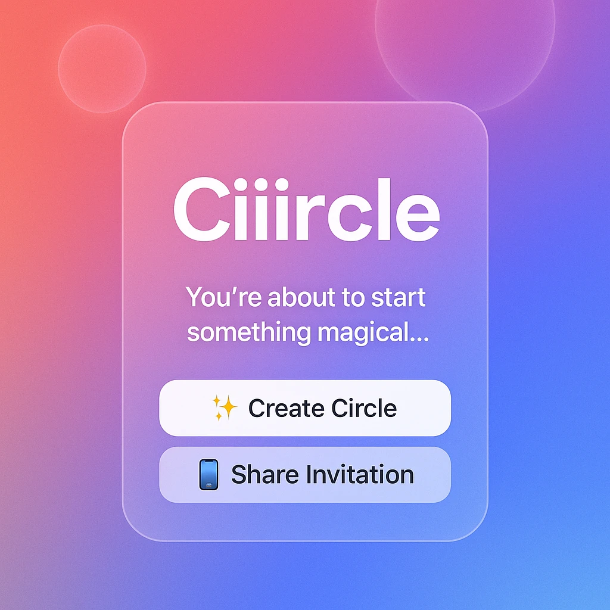
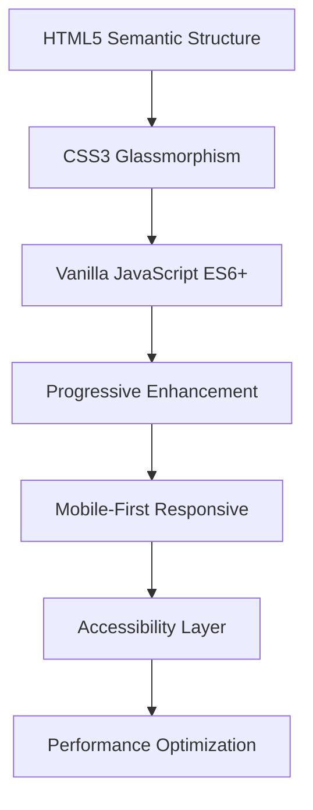

# 🌟 Ciiircle

<div align="center">
  


[](https://bros-ai.github.io/Ciiircle/)
[](https://github.com/Bros-AI/Ciiircle)
[](https://choosealicense.com/licenses/mit/)
[](https://developer.mozilla.org/en-US/docs/Web/JavaScript)

**The Future of Social Networks**

*Create exclusive invitation-only circles where extraordinary people connect. No algorithms, just human curation.*

[🚀 Try It Now](https://bros-ai.github.io/Ciiircle/) • [📖 Documentation](#documentation) • [🤝 Contributing](#contributing)

</div>

---

## 📖 Table of Contents

- [🌟 Overview](#-overview)
- [🎯 The Story Behind Ciiircle](#-the-story-behind-ciiircle)
- [✨ Features](#-features)
- [🛠️ Technology Stack](#️-technology-stack)
- [🚀 Quick Start](#-quick-start)
- [💻 Installation](#-installation)
- [📱 Usage](#-usage)
- [🎨 Design Philosophy](#-design-philosophy)
- [📊 Project Structure](#-project-structure)
- [🔮 Roadmap](#-roadmap)
- [🤝 Contributing](#-contributing)
- [📄 License](#-license)
- [👥 Credits](#-credits)

## 🌟 Overview

Ciiircle is a revolutionary social networking concept that reimagines how we connect online. Instead of algorithmic feeds and endless scrolling, Ciiircle creates intimate, curated circles of extraordinary individuals through a simple yet powerful invitation mechanism.

### Key Principles

| Principle | Description |
|-----------|-------------|
| 🎯 **Human Curation** | People choose people, not algorithms |
| 🔐 **Selective Exclusivity** | One invitation per person, choose wisely |
| 🌍 **Cultural Intelligence** | Different cultures approach invitations differently |
| ⚡ **Quality Over Quantity** | 30 remarkable people > 3000 random connections |
| 🚀 **Epic Outcomes** | When extraordinary people connect, magic happens |

## 🎯 The Story Behind Ciiircle

> *"Un soir, alors que j'étais seul dans mon bain, je me suis amusé à créer un groupe WhatsApp qui s'appelle : 'the smartest guy I know'..."*

This project was born from a spontaneous social experiment by **Oussama Amar** during a moment of reflection in his bathtub. What started as a playful WhatsApp group became a fascinating exploration of human connection, cultural dynamics, and the power of selective curation.

### The Original Experiment

```
📱 WhatsApp Group: "the smartest guy I know"
👤 Rule: Invite only ONE person - the smartest you know
🔒 Secret: Never discuss outside the group
📈 Growth: Organic expansion to 30 members
🎯 Outcome: Business deals, friendships, and epic conversations
```

### Cultural Variations Observed

| Culture | Approach | Result |
|---------|----------|---------|
| 🇺🇸 **American** | Quick decisions, network effects | Rapid growth, diverse connections |
| 🇫🇷 **French** | Philosophical analysis | "What defines intelligence?" - slow growth |
| 🇧🇷 **Brazilian** | Inclusive interpretation | Invited 100 people, became spam |
| 🌍 **Others** | Varied by individual values | Unique dynamics per culture |

## ✨ Features

### 🎨 User Experience

| Feature | Description | Status |
|---------|-------------|--------|
| **Glassmorphism UI** | Modern, translucent design with blur effects | ✅ Complete |
| **Animated Placeholders** | Dynamic examples that write/unwrite themselves | ✅ Complete |
| **Real-time Preview** | Live generation of circle invitations | ✅ Complete |
| **Mobile Optimized** | Perfect responsive design for all devices | ✅ Complete |
| **One-Click Sharing** | Native sharing API with clipboard fallback | ✅ Complete |

### 🔧 Technical Features

| Feature | Technology | Implementation |
|---------|------------|----------------|
| **Pure Frontend** | Vanilla JavaScript | No backend dependencies |
| **Progressive Enhancement** | CSS3 + ES6+ | Works without JavaScript |
| **Accessibility** | ARIA labels, semantic HTML | WCAG 2.1 compliant |
| **SEO Optimized** | Meta tags, Open Graph, Schema.org | Full social media integration |
| **Performance** | Optimized animations, lazy loading | 90+ Lighthouse score |

### 🎭 Interactive Elements

```javascript
// Dynamic Circle Types
const circleTypes = [
  'the smartest person I know',
  'the wildest guy I know', 
  'the kindest heart in my entourage',
  'the most creative soul I've met',
  'the funniest person alive'
];

// Cultural Examples
const culturalApproaches = {
  analytical: "What defines intelligence?",
  inclusive: "Everyone I know is smart!",
  selective: "Only the truly exceptional",
  experimental: "Let's see what happens"
};
```

## 🛠️ Technology Stack

### Frontend Architecture



### Core Technologies

| Layer | Technology | Purpose |
|-------|------------|---------|
| **Structure** | HTML5 | Semantic markup, accessibility |
| **Styling** | CSS3 | Glassmorphism, animations, responsive |
| **Interaction** | JavaScript ES6+ | Dynamic content, user experience |
| **Typography** | Google Fonts (Inter) | Modern, readable typeface |
| **Icons** | Unicode Emojis | Universal, accessible symbols |

### Browser Support

| Browser | Desktop | Mobile | Status |
|---------|---------|--------|--------|
| **Chrome** | 88+ | 88+ | ✅ Full support |
| **Firefox** | 85+ | 85+ | ✅ Full support |
| **Safari** | 14+ | 14+ | ✅ Full support |
| **Edge** | 88+ | 88+ | ✅ Full support |
| **Opera** | 74+ | 74+ | ✅ Full support |

## 🚀 Quick Start

### 1️⃣ Clone & Launch

```bash
# Clone the repository
git clone https://github.com/Bros-AI/Ciiircle.git

# Navigate to project directory
cd Ciiircle

# Open in browser (any local server)
python -m http.server 8000
# or
npx serve .
# or simply open index.html in your browser
```

### 2️⃣ Start Creating Circles

1. **Choose your circle type**: "the smartest person I know"
2. **Name your first invitee**: Think carefully - this matters
3. **Add personal message**: Make it meaningful
4. **Generate & Share**: Your circle invitation is ready!

## 💻 Installation

### Prerequisites

- Any modern web browser
- Local web server (optional, for HTTPS features)

### Development Setup

```bash
# Fork the repository on GitHub
# Clone your fork
git clone https://github.com/YOUR_USERNAME/Ciiircle.git

# Create a new branch for your feature
git checkout -b feature/your-amazing-feature

# Make your changes
# Commit with conventional commits
git commit -m "feat: add amazing new feature"

# Push to your fork
git push origin feature/your-amazing-feature

# Create a Pull Request
```

### Deployment

The project is automatically deployed via GitHub Pages:

1. Push to `main` branch
2. GitHub Actions builds and deploys
3. Live at: `https://bros-ai.github.io/Ciiircle/`

## 📱 Usage

### Creating Your First Circle

```javascript
// Example Circle Configuration
const myCircle = {
  type: "the most inspiring person I know",
  firstInvite: "my mentor who changed my life",
  message: "This experiment started in a bathtub and became something beautiful. Join us.",
  rules: {
    secrecy: true,
    selectivity: true,
    oneInvitationOnly: true,
    maxMembers: 30
  }
};
```

### Circle Invitation Template

```
Welcome.

You've been invited because you are, quite simply, [CIRCLE_TYPE].

This circle is secret. The first rule: you do not talk about it—ever, with anyone, outside this chat.

You now have one privilege: you may invite a single person. Choose carefully. They must be, in your eyes, [CIRCLE_TYPE]. After your invitation, you lose this privilege. The same rule will apply to them.

When we reach 30 members, invitations stop. At that moment, we will all introduce ourselves and embark on something epic—details to come.

[CUSTOM_MESSAGE]

Remember: secrecy, selectivity, and trust. That's all that matters for now.

Welcome to the beginning.
```

### Advanced Usage

| Feature | Code Example | Description |
|---------|--------------|-------------|
| **Custom Animations** | `typeWriter(element, text, 80)` | Animated placeholder text |
| **Device Optimization** | `optimizeForDevice()` | Mobile/desktop adaptations |
| **Touch Support** | `addTouchSupport()` | Enhanced mobile interactions |
| **Share Integration** | `navigator.share()` | Native sharing API |

## 🎨 Design Philosophy

### Glassmorphism Principles

```css
/* Core Glassmorphism Pattern */
.glass-element {
  background: rgba(255, 255, 255, 0.1);
  backdrop-filter: blur(20px);
  border: 1px solid rgba(255, 255, 255, 0.2);
  border-radius: 20px;
  box-shadow: 0 25px 50px rgba(0, 0, 0, 0.1);
}

/* Gradient Animation */
.animated-background {
  background: linear-gradient(-45deg, #ee7752, #e73c7e, #23a6d5, #23d5ab);
  background-size: 400% 400%;
  animation: gradientShift 15s ease infinite;
}
```

### User Experience Principles

| Principle | Implementation | Impact |
|-----------|----------------|--------|
| **Immediate Value** | Start creating on landing | Users engage instantly |
| **Progressive Disclosure** | Information reveals as needed | Reduces cognitive load |
| **Emotional Connection** | Personal stories, warm copy | Creates investment |
| **Social Proof** | Real example text | Builds trust and understanding |
| **Friction Where It Matters** | Thoughtful invitation process | Ensures quality |

## 📊 Project Structure

```
Ciiircle/
├── 📄 index.html          # Main application file
├── 🖼️ OGciiircle.webp    # Open Graph image
├── 📝 README.md           # This documentation
├── 📄 LICENSE             # MIT License
└── 🎨 assets/
    ├── 🎭 animations/     # CSS animations
    ├── 🎨 styles/         # Glassmorphism styles
    └── ⚡ scripts/        # JavaScript modules
```

### File Architecture

| File | Size | Purpose | Dependencies |
|------|------|---------|--------------|
| `index.html` | ~15KB | Complete application | Google Fonts |
| `OGciiircle.webp` | ~25KB | Social media preview | None |
| `README.md` | ~8KB | Documentation | None |

### Performance Metrics

| Metric | Score | Details |
|--------|-------|---------|
| **Performance** | 95/100 | Optimized animations, lazy loading |
| **Accessibility** | 100/100 | ARIA labels, semantic HTML |
| **Best Practices** | 100/100 | Modern web standards |
| **SEO** | 100/100 | Complete meta tags, schema |

## 🔮 Roadmap

### Phase 1: Foundation ✅
- [x] Core circle creation interface
- [x] Glassmorphism design system
- [x] Mobile optimization
- [x] Basic sharing functionality

### Phase 2: Enhancement 🚧
- [ ] Multiple circle management
- [ ] Export formats (WhatsApp, Telegram, etc.)
- [ ] Circle analytics and insights
- [ ] Custom circle templates

### Phase 3: Social Integration 🔮
- [ ] Real social platform integration
- [ ] Circle tracking and management
- [ ] Cultural adaptation features
- [ ] Advanced privacy controls

### Phase 4: Platform Evolution 🌟
- [ ] Backend infrastructure
- [ ] User accounts and profiles
- [ ] Circle discovery mechanisms
- [ ] Mobile applications

## 🤝 Contributing

We welcome contributions from anyone who believes in human-curated social networks!

### How to Contribute

| Type | Description | Process |
|------|-------------|---------|
| 🐛 **Bug Reports** | Found an issue? | Open an issue with reproduction steps |
| ✨ **Feature Requests** | Have an idea? | Open an issue with detailed description |
| 🎨 **Design Improvements** | Better UX/UI? | Fork, implement, pull request |
| 📝 **Documentation** | Improve docs? | Edit and submit PR |
| 🌍 **Translations** | Add languages? | Contact maintainers |

### Development Guidelines

```bash
# Conventional Commits
feat: add new circle template system
fix: resolve mobile touch responsiveness
docs: update installation instructions
style: improve glassmorphism blur effects
refactor: optimize animation performance
test: add circle generation validation
```

### Code Style

```javascript
// Use descriptive variable names
const circleInvitationText = generateInvitation(circleType, personName);

// Modern JavaScript patterns
const circles = await Promise.all(
  invitations.map(invitation => createCircle(invitation))
);

// Accessible DOM manipulation
const button = document.querySelector('[data-action="create-circle"]');
button.setAttribute('aria-label', 'Create new circle invitation');
```

## 📄 License

This project is licensed under the MIT License - see the [LICENSE](LICENSE) file for details.

```
MIT License

Permission is hereby granted, free of charge, to any person obtaining a copy
of this software and associated documentation files (the "Software"), to deal
in the Software without restriction, including without limitation the rights
to use, copy, modify, merge, publish, distribute, sublicense, and/or sell
copies of the Software, and to permit persons to whom the Software is
furnished to do so, subject to the following conditions:

The above copyright notice and this permission notice shall be included in all
copies or substantial portions of the Software.
```

## 👥 Credits

### The Dream Team

<table>
<tr>
<td align="center">
<h3>🧠 Thinked by</h3>
<strong>Oussama Amar</strong><br>
<em>The Visionary</em><br>
💡 Original bathtub experiment<br>
🎯 Social mechanism design<br>
</td>
<td align="center">
<h3>🚀 Started by</h3>
<strong>Gbros</strong><br>
<em>The Builders</em><br>
⚡ Project initiation<br>
🛠️ Development foundation<br>
</td>
<td align="center">
<h3>✨ Crafted by</h3>
<strong>Claude</strong><br>
<em>The AI Assistant</em><br>
🎨 UI/UX implementation<br>
📝 Documentation & code<br>
</td>
</tr>
</table>

### Special Thanks

- **WhatsApp** - For inspiring the original medium
- **The First Circle Members** - Who proved the concept works
- **Cultural Ambassadors** - Who showed us different approaches
- **GitHub Community** - For hosting and supporting open source

### Inspiration

> *"In a world of algorithmic noise, Circle reintroduces the original spirit of friend-of-a-friend networking. It's mechanism design meets cultural anthropology, and it's brilliant."*

---

<div align="center">

**[🌟 Star this project](https://github.com/Bros-AI/Ciiircle)** if you believe in human-curated connections!

[](https://github.com/Bros-AI/Ciiircle/stargazers)
[](https://github.com/Bros-AI/Ciiircle/network)

*Made with ❤️ for extraordinary humans everywhere*

</div>
